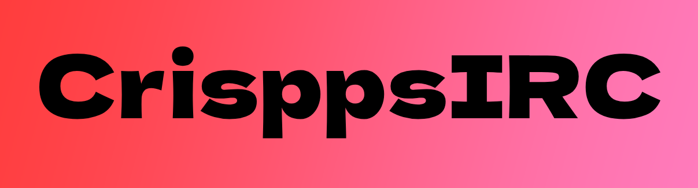

  CrisspsIRC is a simple, lightweight IRC client created as a personal project to connect to a friend's IRC server.

<pre>

</pre>

Source: <a href="https://github.com/henmel1/CrisppsIRC"><i class="large github icon "></i>henmel1/CrisppsIRC</a>
